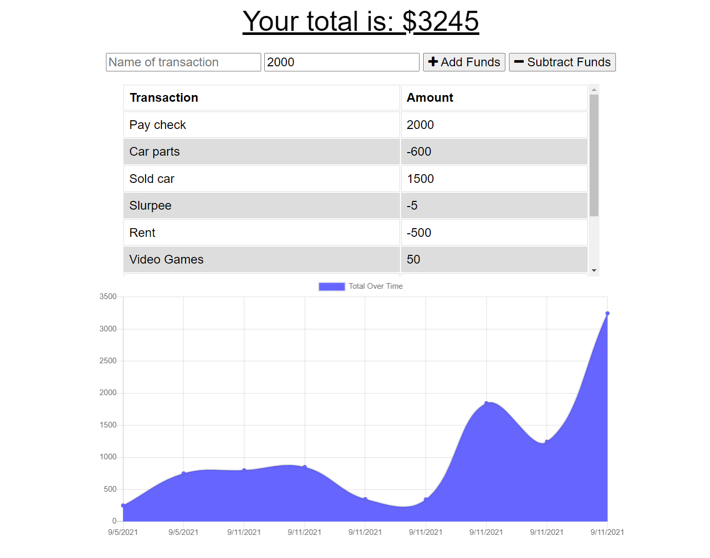

# <h1 align='center'> Online/Offline Budget Tracker 💵 </h1>
<p align='center'> This simple app allows users to keep track of money transactions by adding and subtracting funds, while offline and online using service workers, manifest and indexedDB! </p>

## Deployed on Heroku

## Table of Contents 
- [Built With](#built-with)
- [App View](#view)
- [Installation](#installation)
- [Usage](#usage)
- [Credits](#credits)

## Built With
* Express
* Javscript ES6
* Node.js
* Mongoose

## View


## Usage 
* Fork/clone this repositiory
* Run ``` npm i ``` to install all the needed packages for this app

To start app :

``` 
npm start
OR
nodemon server.js
```

## Credits 
Starting code was provided by © 2021 Trilogy Education Services, LLC, a 2U, Inc. brand. All Rights Reserved.